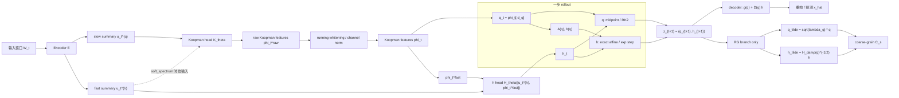

# Neural Dynamic System

目标：从时间序列中学出一个可解释的慢快动力学模型，把观测分解成 `Koopman slow state q + hidden fast memory h`，用于重构、预测和 RG/semigroup 一致性约束。

## 模型架构图



这个 README 只描述当前代码里真实实现的模型，不沿用旧的 `q,m` 文案。

当前实现的核心是：

- 显式 Koopman 特征头 `phi`
- `q` 作为 `phi` 的 slow 子空间
- `h` 作为隐藏快变量 / memory embedding
- `q` 用 fixed-step midpoint
- `h` 用结构化 exact affine / exponential step
- RG 使用专门的谱归一化坐标，只在 RG 分支里启用

一句话概括：

> 这是一个 `Koopman features + slow q + affine hidden SSM h + structured decoder + RG-only spectral coarse graining` 的实现。它已经是 SSD-ready，但还不是完整的 Mamba fused kernel。

## 当前模型长什么样

输入窗口

$$
W_t = [x_{t-L+1}, \dots, x_t]
$$

先经过 encoder：

$$
(u_t^{(q)}, u_t^{(h)}) = E(W_t)
$$

然后显式产生 Koopman 特征：

$$
\phi_t^{raw} = K_\theta(u_t)
$$

$$
\phi_t = Whiten(\phi_t^{raw})
$$

这里 `phi_t` 的维度是 `koopman_dim`。
在当前代码里，这一步更准确地说是 running mean 加按通道方差归一化，用来尽量保留 Koopman 模态顺序。

慢变量不是单独再学一套完全独立的向量，而是直接取 Koopman 特征的 slow 子空间：

$$
q_t = \phi_t[:d_q]
$$

隐藏快变量由 encoder 的 fast summary 和 Koopman 特征共同初始化：

$$
h_t = H_\theta([u_t^{(h)}, \phi_t^{fast}])
$$

最终 latent state 是

$$
z_t = (q_t, h_t)
$$

补充说明：

- `hard_split` 时，Koopman 头只看 `u_t^(q)`；`soft_spectrum` 时，Koopman 头看 `[u_t^(q), u_t^(h)]`。
- `h` 的初始化来自 `fast_hidden` 和 Koopman 特征；`q` 则直接取 Koopman 特征的前 `q_dim` 维。
- RG 坐标只用于 RG loss 分支，不参与主干 encoder、主干 rollout 和主干 decoder。

## 代码里的最终动力学

### 1. Koopman 速率

模型维护一组全局可训练正速率

$$
0 < \lambda_1 \le \lambda_2 \le \dots \le \lambda_K
$$

其中 `K = koopman_dim`。

前 `q_dim` 个速率就是慢变量的主对角衰减率：

$$
\Lambda_q = diag(\lambda_1, \dots, \lambda_{d_q})
$$

### 2. 慢变量方程

当前代码里的 `q` 动力学是

$$
\dot q = - \Lambda_q q + r_q(q) + B h
$$

其中：

- `- Lambda_q q` 是 Koopman-aligned slow decay
- `r_q(q)` 是小的非线性残差项
- `B h` 是 hidden memory 对 slow manifold 的耦合

实现上：

- `B` 是一个常数线性耦合矩阵
- `r_q(q)` 由 `q_residual_net` 给出并经过 `tanh`

### 3. 隐藏快变量方程

当前代码把 `h` 写成 `q` 条件化的 affine hidden SSM：

$$
\dot h = A(q) h + b(q)
$$

其中

$$
A(q) = - diag(r_h(q)) + alpha U diag(gamma(q)) V^T
$$

这里：

- `r_h(q)` 是正的 fast rates
- `U, V` 是全局低秩因子
- `gamma(q)` 是 `q` 条件化低秩系数
- `alpha = hidden_operator_scale`

驱动项是

$$
b(q) = beta tanh(f_h(q))
$$

这里 `beta = hidden_drive_scale`。

这意味着当前 `h` 子系统不是一个任意黑箱 ODE，而是一个稳定对角基座加低秩修正的仿射状态空间模型。

## 为什么 `q` 用 midpoint，而 `h` 用 exact affine step

### `q` 用 midpoint / RK2

代码里的 `q` 用的是固定步长 midpoint：

$$
q_{n+1/2} = q_n + 0.5 dt f_q(q_n, h_n)
$$

$$
q_{n+1} = q_n + dt f_q(q_{n+1/2}, h_{n+1/2})
$$

这里不是直接用 neural ODE solver，原因是：

1. 当前训练目标本来就是固定 `dt`、固定 horizon 的离散 rollout。
2. Koopman、semigroup、RG 都围绕一个明确的离散映射 `F_dt` 来约束。
3. neural ODE 学到的是“向量场 + 求解器”的组合，不够干净，也不利于和 SSD 快分支对齐。
4. midpoint 比 Euler 稳，代价又远低于通用 ODE solver。

所以这里选 midpoint，不是因为“看起来像 ODE”，而是因为它给了我们一个明确、固定、二阶的离散流映射。

### `h` 不用普通 RK2，而用 exact affine step

当一步内把 `q` 冻结或用中点冻结时，`h` 的方程

$$
\dot h = A h + b
$$

在一步内是仿射线性的，所以一步解可以直接写成

$$
h_{n+1} = \bar A h_n + \bar b
$$

其中 `bar A` 和 `bar b` 来自增广矩阵指数。

这比直接对 `h` 用 RK2 更合理，原因是：

1. `h` 子系统本来就有结构化闭式一步映射，没必要退回近似法。
2. `h` 是快变量，通常更 stiff，普通显式 RK2 更容易破坏收缩性。
3. `q` 的方程里有 `B h`，所以 `h` 的数值误差会直接污染 slow dynamics。
4. SSD / scan kernel 需要的正是

   $$
   h_{n+1} = \bar A_n h_n + \bar b_n
   $$

   这种递推形式。

所以当前代码保留了：`q` 用 midpoint，`h` 用 exact affine / exponential step。

## 为什么 RG 特殊变换只在 RG 分支里用

RG 关心的是“尺度比较”，不是主模型的本体坐标。

主模型的 latent 还是

$$
z = (q, h)
$$

但在 RG 分支里，代码先做一个专用坐标变换：

$$
\tilde q = \sqrt{\lambda_q} \odot q
$$

$$
H_{damp}(q) = - \frac{A(q) + A(q)^T}{2}
$$

$$
\tilde h = H_{damp}(q)^{-1/2} h
$$

这一步的目的只是让不同时间尺度的量在同一个尺度下比较。
也就是说，当前 `h` 的 RG 归一化不再是逐维 `1 / \sqrt{r_h(q)}`，而是按 hidden operator 的对称阻尼度量做矩阵归一化。

它不应该被强行塞进主 encoder、主 rollout、主 decoder 里，否则整个模型都会被 RG 坐标绑架，重构与预测会更难训，解释也会变差。

所以当前实现是：

- 主动力学在原始 `z = (q,h)` 上做
- 只有 RG loss 里，才进入 `(\tilde q, \tilde h)` 坐标

## 当前 RG 是怎么做的

在 RG 坐标里，coarse-graining 写成

$$
\tilde q' = m(s) \odot \tilde q + delta_q(\tilde q)
$$

$$
\tilde h' = \tilde h / s
$$

其中：

- `s = rg_scale`
- `m(s)` 是按 Koopman 速率构造的 soft mask
- `delta_q` 是一个 near-identity 小修正

soft mask 的思想是：

- 慢模态保留更多
- 相对更快的 slow modes 在更 coarse 的尺度下被压小

代码里 cutoff 用的是

$$
\lambda_c = max(\lambda_q) / s
$$

再通过 `sigmoid` 做 soft mask。
对 `h` 的 coarse-graining 仍然是在 RG 坐标里做 `\tilde h' = \tilde h / s`，然后再通过 `H_{damp}(q)^{1/2}` 映回原始 hidden 坐标。

RG loss 比较的是：

$$
C_s(F_{dt}^r(z))
$$

和

$$
F_{s dt}^r(C_s(z))
$$

也就是：

- 先推进再 coarse-grain
- 先 coarse-grain 再用大步长推进

它们是否近似一致。

注意：这里只有带 `C_s` 的项才是 RG。单纯的

$$
F_dt(F_dt(z)) \approx F_{2dt}(z)
$$

只是 semigroup consistency，不是 RG。

## Encoder 和 latent 分配

### `temporal_conv`

`TemporalMultiscaleEncoder` 用多尺度时序卷积提取：

- `u^(q)`：偏慢、偏全局的 summary
- `u^(h)`：带更多多尺度 fast 信息的 summary

### `mlp`

窗口直接 flatten 后经过 MLP。

### `latent_scheme`

当前仍支持：

- `hard_split`
- `soft_spectrum`

差别是：

- `hard_split`：Koopman 头只看 `u^(q)`
- `soft_spectrum`：Koopman 头看 `[u^(q), u^(h)]`，并用谱权重构造 fast-side initialization

也就是说，`soft_spectrum` 现在不再是旧版“`q,m` 两块 latent 的最终定义”，而是 Koopman feature construction 的方式。

## 当前训练目标

### 1. Reconstruction

结构化 decoder 仍然是

$$
\hat x = g(q) + D(q) h
$$

损失：

$$
L_rec = MSE(\hat x_t, x_t)
$$

### 2. VAMP-2

VAMP 现在作用在显式 Koopman 特征 `phi` 上，而不是只作用在 `q` 上。

$$
L_vamp = - VAMP2(\phi_t, \phi_{t+\tau})
$$

### 3. Time-lag diagonalization

仍然作用在 `phi` 上，推动 time-lag covariance 更接近对角。

### 4. Koopman modal decay

对每个 Koopman feature，代码用学习到的速率做一阶指数衰减约束：

$$
\phi_{t+\tau} \approx exp(- \lambda \tau) \odot \phi_t
$$

### 5. Multi-step prediction

从 `z_t` rollout 到多个 horizon，再解码到观测空间。

### 6. Q alignment

rollout 后的 `q` 要和未来窗口重新编码得到的 `q` 对齐。

### 7. Latent alignment

rollout 后的整个 `z` 要和未来窗口重新编码得到的 `z` 对齐。

### 8. Semigroup consistency

要求不同 horizon 的 flow 复合近似一致。

### 9. Separation

要求 `h` 的平均快速率大于 `q` 的平均慢速率。

### 10. Contract

要求 hidden generator 的对称部谱上界不要跑到不稳定区域。

### 11. RG loss

只在 phase 3 打开，并且只在 RG 分支里用谱归一化坐标。

### 12. Hidden L1

控制 `h` 的幅值，不让 memory branch 无限制膨胀。

## 当前代码为什么说是 SSD-ready

因为 `h` 的一步更新已经被整理成了

$$
h_{n+1} = \bar A_n h_n + \bar b_n
$$

并且 `A(q)` 本身是“稳定对角基座 + 低秩条件修正”的形式。这和后续的 SSD / DPLR / scan kernel 很接近。

当前还不是完整 Mamba kernel，原因也很明确：

1. `q` 仍然是非线性 midpoint 更新。
2. `q` 和 `h` 之间仍有双向耦合。
3. 当前 `h` 的离散化还是用 `torch.matrix_exp`，不是 fused selective scan。
4. 没有 Triton / CUDA fused kernel。

所以更准确的说法是：

> 现在的 hidden branch 已经是 SSD-ready 的 affine SSM，但整个模型还不是完整的 Mamba block。

## 主要代码位置

- `neural_dynamic_system/model.py`
  - `koopman_head`
  - `koopman_whitener`
  - `latent_statistics`
  - `hidden_ssm_matrices`
  - `step`
  - `rg_transform`
  - `coarse_grain`

- `neural_dynamic_system/training.py`
  - `_vamp2_score`
  - `_koopman_consistency_loss`
  - `_q_align_loss`
  - `_semigroup_loss`
  - `_loss_bundle`

- `neural_dynamic_system/cli.py`
  - 训练入口
  - summary 导出
  - koopman / q / h / z probe

## 运行方式

一个小的 synthetic smoke test：

```bash
python -m neural_dynamic_system.cli \
  --synthetic_kind toy \
  --num_episodes 2 \
  --steps 256 \
  --obs_dim 6 \
  --window 16 \
  --q_dim 2 \
  --h_dim 2 \
  --koopman_dim 6 \
  --modal_dim 6 \
  --hidden_dim 32 \
  --batch_size 32 \
  --epochs 2 \
  --horizons 1 2 \
  --out_dir runs/neural_dynamic_system/demo
```

也可以直接跑脚本：

```bash
python scripts/run_neural_dynamic_system.py --synthetic_kind toy
```

## 新增和重要参数

- `--koopman_dim`
  - 显式 Koopman 特征维度
  - 如果不传，代码会默认取 `max(q_dim, modal_dim)`

- `--hidden_rank`
  - hidden low-rank operator 的秩

- `--rg_temperature`
  - RG soft mask 的温度

- `--q_dim`
  - 取 Koopman 特征前多少维作为 slow subspace

- `--h_dim`
  - hidden fast state 维度

- `--latent_scheme`
  - `hard_split` 或 `soft_spectrum`

## 输出文件

当前会导出：

- `model.pt`
- `history.csv`
- `config.json`
- `summary.json`
- `trajectory_preview.csv`
- 合成数据时的 `synthetic_hidden_state.csv`
- probe 结果

现在 probe 会同时评估：

- `koopman`
- `q`
- `h`
- `z`

## 当前实现的取舍

1. 保留显式 Koopman 特征头  
   因为如果没有 `phi`，Koopman 那部分就只剩文案，没有明确对象。

2. `q` 不走 black-box neural ODE  
   因为我们更需要一个固定步长、明确的 `F_dt`。

3. `h` 不走普通 RK2  
   因为它本来就是 affine hidden SSM，更适合 exact step。

4. RG 变换只在 RG 分支里用  
   因为它是尺度比较坐标，不是主模型本体坐标。

5. 当前 hidden operator 先做成 DPLR-like 结构  
   这样比完全 dense 的 `A(q)` 更适合后续 SSD 化。

## 局限

- 还没有 fused Mamba kernel。
- `h` 虽然已经 SSD-ready，但当前离散化还是 dense `matrix_exp`。
- RG 仍然是一个 latent-level coarse-grain consistency prior，不是完整的 RG 理论程序。
- 还没有涨落-耗散或随机项。

## 当前版本的最终描述

> 当前仓库实现的是一个显式 Koopman + Mori-Zwanzig + RG 风格的 `q/h` 慢快状态空间模型。`phi` 是显式 Koopman 特征，`q` 是其 slow 子空间，`h` 是 affine hidden SSM memory state；`q` 用 midpoint 推进，`h` 用 exact affine / exponential step 推进；RG 通过专门的谱归一化坐标和 coarse-grain 映射只在 RG 分支里约束。这个结构在理论上比旧版 `q,m` 文案更贴近当前代码，在工程上也更接近后续 SSD/Mamba 化的方向。
