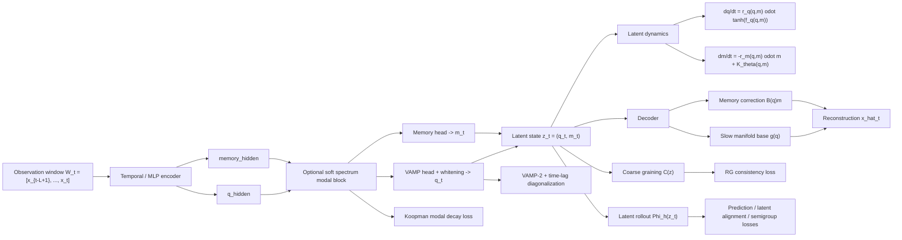

# Neural Dynamic System

Neural Dynamic System is a latent dynamics framework for learning slow collective coordinates, unresolved-memory closure, multiscale coarse graining, and manifold reconstruction from time-series trajectories. The implementation in this repository combines four ideas into one trainable model:

1. Koopman / VAMP-style slow coordinate discovery.
2. Mori-Zwanzig-inspired memory augmentation.
3. Renormalization-group-like coarse graining in latent space.
4. Slow-manifold decoding for reconstructing observables.

The code is organized around a latent split

$$
z_t = (q_t, m_t),
$$

where $q_t$ represents slow coordinates and $m_t$ represents unresolved memory variables. The model reads a short observation window

$$
W_t = [x_{t-L+1}, x_{t-L+2}, \ldots, x_t], \qquad x_t \in \mathbb{R}^d,
$$

encodes it into $(q_t, m_t)$, evolves the latent state with a neural dynamics model, and decodes back to the observation space.

## Why this repo exists

Many real systems are not well described by a single Markovian low-dimensional latent ODE. Molecular dynamics, climate subgrid closure, reaction networks, and strongly multiscale systems often contain:

- slow reaction coordinates,
- fast unresolved modes,
- nonlocal memory effects,
- scale-dependent effective dynamics.

This repository tries to model all of them jointly. Instead of assuming that a slow latent code alone is sufficient, it explicitly introduces a memory block $m_t$, regularizes time-scale separation, and imposes an RG-like consistency relation between fine and coarse latent dynamics.

## Repository structure

```text
neural_dynamic_system/
  __init__.py
  cli.py
  config.py
  data.py
  model.py
  synthetic.py
  training.py
scripts/
  run_neural_dynamic_system.py
README.md
```

Core module mapping:

- `neural_dynamic_system/model.py`: encoder, latent dynamics, decoder, slow-manifold projection, RG coarse graining.
- `neural_dynamic_system/training.py`: VAMP/Koopman/MZ/RG-related loss terms and curriculum training.
- `neural_dynamic_system/data.py`: windowed dataset construction and train/validation split.
- `neural_dynamic_system/synthetic.py`: toy, no-gap toy, and alanine-like synthetic trajectory generators.
- `neural_dynamic_system/cli.py`: command-line training entrypoint.
- `scripts/run_neural_dynamic_system.py`: thin wrapper around the package CLI.

## Installation

This repository currently does not ship a `pyproject.toml` or `requirements.txt`, so install the runtime dependencies manually:

```bash
pip install torch numpy pandas
pip install torchdiffeq  # optional, enables Dopri5 latent integration
```

If `torchdiffeq` is not installed, the model still works and falls back to the built-in latent stepper.

## Quick start

Run a small synthetic experiment:

```bash
python -m neural_dynamic_system.cli \
  --synthetic_kind toy \
  --num_episodes 4 \
  --steps 4096 \
  --obs_dim 8 \
  --window 32 \
  --q_dim 2 \
  --m_dim 2 \
  --latent_scheme soft_spectrum \
  --modal_dim 8 \
  --out_dir runs/neural_dynamic_system/toy_demo
```

Equivalent script entry:

```bash
python scripts/run_neural_dynamic_system.py \
  --synthetic_kind toy \
  --out_dir runs/neural_dynamic_system/toy_demo
```

Run the alanine-like benchmark:

```bash
python -m neural_dynamic_system.cli \
  --synthetic_kind alanine_like \
  --num_episodes 4 \
  --steps 8192 \
  --obs_dim 16 \
  --window 64 \
  --q_dim 2 \
  --m_dim 4 \
  --latent_scheme soft_spectrum \
  --modal_dim 12 \
  --curriculum_preset alanine_bootstrap \
  --out_dir runs/neural_dynamic_system/alanine_like
```

Train on your own trajectory array:

```bash
python -m neural_dynamic_system.cli \
  --data_path path/to/trajectory.npy \
  --window 64 \
  --q_dim 3 \
  --m_dim 3 \
  --horizons 1 2 4 8 \
  --out_dir runs/neural_dynamic_system/custom_run
```

Supported input formats:

- `.npy`
- `.npz`
- `.csv`

Optional aligned label arrays can be passed with `--label_path` for supervised probing or partial latent supervision.

## Output files

Each run writes artifacts under `--out_dir`:

- `model.pt`: model state, configs, normalization statistics, and optional label statistics.
- `history.csv`: per-epoch train/validation metrics.
- `config.json`: data source, configs, and normalization metadata.
- `summary.json`: best validation metrics and latent-spectrum summary.
- `trajectory_preview.csv`: first 512 standardized observation steps for inspection.
- `synthetic_hidden_state.csv`: hidden latent truth for synthetic benchmarks.
- `synthetic_labels.csv`: synthetic supervision labels when available.
- `synthetic_probe_labels.csv`: held-out probe labels for synthetic evaluation.
- `label_probe.json` or `synthetic_hidden_probe.json`: downstream probe scores.
- `label_component_corrs.csv` or `synthetic_component_corrs.csv`: best component-label correlations.

## Architecture



## Mathematical formulation

### 1. Windowed latent encoding

The input is a context window $W_t \in \mathbb{R}^{L \times d}$. The encoder produces two hidden summaries:

$$
(h_t^{(q)}, h_t^{(m)}) = E_\theta(W_t).
$$

In `temporal_conv` mode, `TemporalMultiscaleEncoder` applies multiscale 1D convolutions and residual blocks over time. In `mlp` mode, the window is flattened and processed by an MLP.

There are two latent partition schemes.

#### Hard split

The simplest scheme directly assigns

$$
q_t^{\text{src}} = h_t^{(q)}, \qquad m_t^{\text{src}} = h_t^{(m)}.
$$

#### Soft spectrum

The more interesting scheme first learns modal coordinates

$$
a_t = \tanh\!\big(f_{\text{modal}}([h_t^{(q)}, h_t^{(m)}])\big) \in \mathbb{R}^K.
$$

Each mode gets a positive decay rate

$$
\lambda_k = \lambda_{\min}^{(q)} + \operatorname{softplus}(\theta_k),
$$

and the model constructs slow and memory weights from the log-spectrum:

$$
\ell_k = \frac{\log \lambda_k - \frac{1}{K}\sum_j \log \lambda_j}{\tau},
$$

$$
w_k^{\text{slow}} = \frac{e^{-\ell_k}}{\sum_j e^{-\ell_j}}, \qquad
w_k^{\text{mem}} = \frac{e^{\ell_k}}{\sum_j e^{\ell_j}},
$$

where $\tau$ is `modal_temperature`.

The same modal vector is then partitioned softly:

$$
q_t^{\text{src}} = a_t \odot w^{\text{slow}}, \qquad
m_t^{\text{src}} = a_t \odot w^{\text{mem}}.
$$

This is a useful compromise between a fully hand-engineered split and a completely entangled latent code.

### 2. VAMP whitening and slow coordinates

The slow coordinate head computes

$$
\tilde q_t = f_{\text{vamp}}(q_t^{\text{src}}).
$$

`RunningWhitenedVAMP` maintains a running mean $\mu$ and covariance $C$ and outputs

$$
q_t = (\tilde q_t - \mu) C^{-1/2}.
$$

This whitening matters because Koopman/VAMP objectives are easiest to optimize when slow features are approximately decorrelated and normalized.

The memory state is produced by a linear head:

$$
m_t = W_m m_t^{\text{src}} + b_m.
$$

Finally,

$$
z_t = [q_t, m_t].
$$

### 3. Koopman viewpoint

For a suitable observable dictionary, Koopman theory suggests approximately linear time evolution:

$$
\psi(x_{t+\tau}) \approx K_\tau \psi(x_t).
$$

This repository uses two complementary approximations to that idea.

#### 3.1 VAMP-2 objective

Given batch matrices $Q_0$ and $Q_\tau$ of whitened slow features from lagged windows, define centered versions

$$
\bar Q_0 = Q_0 - \operatorname{mean}(Q_0), \qquad
\bar Q_\tau = Q_\tau - \operatorname{mean}(Q_\tau).
$$

Then

$$
C_{00} = \frac{1}{B-1}\bar Q_0^\top \bar Q_0 + \epsilon I,
$$

$$
C_{\tau\tau} = \frac{1}{B-1}\bar Q_\tau^\top \bar Q_\tau + \epsilon I,
$$

$$
C_{0\tau} = \frac{1}{B-1}\bar Q_0^\top \bar Q_\tau.
$$

The VAMP-2 score is

$$
\mathcal{S}_{\text{VAMP-2}} = \left\| C_{00}^{-1/2} C_{0\tau} C_{\tau\tau}^{-1/2} \right\|_F^2.
$$

The training loss uses

$$
\mathcal{L}_{\text{VAMP}} = -\frac{1}{d_q}\mathcal{S}_{\text{VAMP-2}}.
$$

In code this is `_vamp2_score(...)` in `training.py`.

#### 3.2 Time-lag diagonalization

To encourage approximately decoupled slow coordinates, the time-lagged covariance is pushed toward diagonal form:

$$
\mathcal{L}_{\text{diag}} =
\left\| C_{0\tau} - \operatorname{diag}(C_{0\tau}) \right\|_F^2.
$$

This is implemented by `_time_lag_covariance(...)` and `_offdiag_frobenius_loss(...)`.

#### 3.3 Explicit modal Koopman decay

In `soft_spectrum` mode, the modal coordinates are explicitly regularized to decay exponentially:

$$
a_{t+\tau}^{\text{pred}} = e^{-\lambda \tau} \odot a_t,
$$

$$
\mathcal{L}_{\text{koopman}} =
\operatorname{MSE}(a_{t+\tau}, a_{t+\tau}^{\text{pred}}).
$$

This is not a full Koopman eigenfunction theory, but it is a practical spectral bias that nudges the latent basis toward ordered relaxation modes.

### 4. Mori-Zwanzig viewpoint and memory closure

The Mori-Zwanzig projection formalism says that after eliminating unresolved variables, the effective slow dynamics generally becomes non-Markovian:

$$
\frac{d}{dt} q(t) = R(q(t)) + \int_0^t \mathcal{K}(t-s, q(s))\, ds + F(t).
$$

Directly learning the full memory integral is difficult, so this repository uses a Markovian embedding with hidden memory states $m_t$:

$$
\frac{d}{dt} q = f_q(q, m), \qquad
\frac{d}{dt} m = -\Lambda_m(q,m)\odot m + K_\theta(q,m).
$$

Concretely, the implementation uses

$$
r_q(q,m) = r_{q,\min} + \operatorname{softplus}(f_{q,\text{rate}}(q,m)),
$$

$$
r_m(q,m) = r_{m,\min} + \operatorname{softplus}(f_{m,\text{rate}}(q,m)),
$$

$$
u_q(q,m) = \tanh(f_{q,\text{drift}}(q,m)),
$$

$$
\frac{d}{dt} q = r_q(q,m) \odot u_q(q,m),
$$

$$
K_\theta(q,m) = 0.1 \tanh(f_{\text{kernel}}(q,m)),
$$

$$
\frac{d}{dt} m = -r_m(q,m)\odot m + K_\theta(q,m).
$$

Interpretation:

- $q$ stores slow collective coordinates.
- $m$ stores unresolved closure states.
- $r_q$ and $r_m$ are learned positive rates.
- $K_\theta(q,m)$ is a nonlinear closure source term.

If $m$ is eliminated analytically in a linearized setting, one recovers exponentially weighted memory kernels, so this latent ODE is a finite-dimensional proxy for a generalized Langevin or Mori-Zwanzig closure.

### 5. Exponential memory integrator

The memory equation contains a stiff decay term $-r_m \odot m$. Instead of using a naive explicit Euler step, the implementation uses an exponential-style update:

$$
\phi_1(x) = \frac{1 - e^{-x}}{x}.
$$

For constant rates and forcing over one step,

$$
m_{t+\Delta t}
= e^{-r_m \Delta t} \odot m_t
+ \Delta t \, \phi_1(r_m \Delta t)\odot K_\theta(q,m).
$$

The code uses a midpoint-style version of this formula in `LatentRGManifoldAutoencoder.step(...)`:

- $q$ is advanced with an explicit midpoint step.
- $m$ is advanced with an exponential integrator using `phi1`.

This matters because the memory block may decay faster than the slow block, and a standard explicit scheme would be much less stable.

### 6. Slow manifold decoder

The decoder is intentionally structured as a base slow manifold plus a memory correction:

$$
\hat x_t = g(q_t) + B(q_t) m_t.
$$

Here

- $g(q_t)$ is the decoded slow-manifold state,
- $B(q_t) \in \mathbb{R}^{d \times d_m}$ is a learned memory readout basis,
- $B(q_t)m_t$ is the unresolved correction.

In code:

$$
g(q) = \texttt{manifold\_decoder}(q),
$$

$$
B(q) = \operatorname{reshape}(\texttt{memory\_readout\_net}(q)).
$$

So the final reconstruction is

$$
\hat x = g(q) + B(q)m.
$$

This design is important. It means the repository does not treat the decoder as a generic black box; it explicitly assumes that the observable can be decomposed into a dominant slow manifold plus a memory-dependent correction.

The repository also exposes an explicit slow-manifold projection:

$$
\Pi_{\mathcal{M}}(q,m) = (q, 0),
$$

implemented by `project_to_manifold(...)`.

### 7. Renormalization-group-like coarse graining

The latent state can be coarse-grained with

$$
\mathcal{C}(q,m) = \left(q + \delta q, \frac{m}{s}\right),
$$
$$
\delta q = \tanh(f_{\text{coarse}}(q)) \cdot \frac{\alpha}{s},
$$

where

- $s =$ `rg_scale`,
- $\alpha =$ `coarse_strength`.

The RG consistency penalty enforces that coarse graining and time evolution approximately commute:

$$
\mathcal{C}\left(\Phi_{\Delta t}^{(h)}(z_t)\right)
\approx
\Phi_{s\Delta t}^{(h)}\left(\mathcal{C}(z_t)\right).
$$

The corresponding loss is

$$
\mathcal{L}_{\text{RG}}
=
\operatorname{MSE}\!\left(
\mathcal{C}(\Phi_{\Delta t}^{(h)}(z_t)),
\Phi_{s\Delta t}^{(h)}(\mathcal{C}(z_t))
\right).
$$

This is implemented in `_loss_bundle(...)` through `coarse_after_fine` and `fine_after_coarse`.

Conceptually, this says that the latent dynamics should define a reasonable effective theory at a coarser scale, not just a one-off predictive latent code.

### 8. Multi-horizon rollout consistency

For horizons $h \in \mathcal{H}$, the model rolls out

$$
\hat z_{t+h} = \Phi^{(h)}(z_t).
$$

Those predictions are compared to latent encodings of future windows:

$$
z_{t+h}^{\text{enc}} = E_\theta(W_{t+h}).
$$

The repository uses several consistency losses:

#### 8.1 Observation prediction

$$
\mathcal{L}_{\text{pred}}
= \frac{1}{|\mathcal{H}|}\sum_{h \in \mathcal{H}}
\operatorname{MSE}\!\left(D(\hat z_{t+h}), x_{t+h}\right).
$$

#### 8.2 Latent alignment

$$
\mathcal{L}_{\text{latent-align}}
= \frac{1}{|\mathcal{H}|}\sum_{h \in \mathcal{H}}
\operatorname{MSE}\!\left(\hat z_{t+h}, z_{t+h}^{\text{enc}}\right).
$$

#### 8.3 Slow-coordinate alignment

$$
\mathcal{L}_{q\text{-align}}
= \frac{1}{|\mathcal{H}|}\sum_{h \in \mathcal{H}}
\operatorname{MSE}\!\left(\hat q_{t+h}, q_{t+h}^{\text{enc}}\right).
$$

This is named `vamp_align_loss` in the training code.

#### 8.4 Semigroup consistency

For any $h_1, h_2, h_1+h_2 \in \mathcal{H}$,

$$
\Phi^{(h_2)}\!\left(z_{t+h_1}^{\text{enc}}\right)
\approx
z_{t+h_1+h_2}^{\text{enc}}.
$$

So the semigroup penalty is

$$
\mathcal{L}_{\text{semigroup}}
=
\operatorname{mean}_{h_1,h_2}
\operatorname{MSE}\!\left(
\Phi^{(h_2)}(z_{t+h_1}^{\text{enc}}),
z_{t+h_1+h_2}^{\text{enc}}
\right).
$$

This encourages a genuinely dynamical latent representation rather than an arbitrary autoencoding coordinate system.

### 9. Time-scale separation and contraction

The implementation explicitly encourages the memory block to relax faster than the slow block. Let

$$
\bar r_q = \operatorname{mean}(r_q),
\qquad
\bar r_m = \operatorname{mean}(r_m).
$$

The separation gap is

$$
\Delta_{\text{sep}} = \bar r_m - \bar r_q.
$$

The loss is

$$
\mathcal{L}_{\text{sep}} =
\operatorname{ReLU}(\gamma_{\text{sep}} - \Delta_{\text{sep}}),
$$

where `separation_margin` is $\gamma_{\text{sep}}$.

There is also a contraction-style condition on the memory dynamics. Write

$$
J_m(q,m) = \frac{\partial K_\theta(q,m)}{\partial m},
$$

and let

$$
J_m^{\text{sym}} = \frac{1}{2}(J_m + J_m^\top).
$$

The code penalizes violations of

$$
\lambda_{\max}(J_m^{\text{sym}})
\le
\min_i r_{m,i} - \gamma_{\text{contract}},
$$

which is a sufficient local condition pushing the memory subsystem toward contraction after accounting for its decay term.

### 10. Metric preservation

The metric loss encourages the slow coordinates to preserve neighborhood geometry of the windowed input:

$$
\mathcal{L}_{\text{metric}}
=
\operatorname{MSE}\!\left(
\widetilde D(W_i, W_j),
\widetilde D(q_i, q_j)
\right),
$$

where $\widetilde D$ is the pairwise distance matrix normalized by its mean.

This helps prevent the learned slow coordinates from becoming spectrally good but geometrically degenerate.

### 11. Full training objective

The total loss is the weighted sum

$$
\mathcal{L}
=
\lambda_{\text{rec}}\mathcal{L}_{\text{rec}}
+ \lambda_{\text{vamp}}\mathcal{L}_{\text{VAMP}}
+ \lambda_{q\text{-align}}\mathcal{L}_{q\text{-align}}
+ \lambda_{\text{koop}}\mathcal{L}_{\text{koopman}}
+ \lambda_{\text{diag}}\mathcal{L}_{\text{diag}}
+ \lambda_{\text{pred}}\mathcal{L}_{\text{pred}}
+ \lambda_{\text{latent}}\mathcal{L}_{\text{latent-align}}
+ \lambda_{\text{sg}}\mathcal{L}_{\text{semigroup}}
+ \lambda_{\text{contract}}\mathcal{L}_{\text{contract}}
+ \lambda_{\text{sep}}\mathcal{L}_{\text{sep}}
+ \lambda_{\text{RG}}\mathcal{L}_{\text{RG}}
+ \lambda_{\text{metric}}\mathcal{L}_{\text{metric}}
+ \lambda_{\ell_1}\|m\|_1
+ \mathcal{L}_{\text{sup}}.
$$

Default weights are defined in `LossConfig`:

```python
LossConfig(
    reconstruction_weight=1.0,
    vamp_weight=0.2,
    vamp_align_weight=0.25,
    koopman_weight=0.25,
    diag_weight=0.05,
    prediction_weight=1.0,
    latent_align_weight=0.75,
    semigroup_weight=0.5,
    separation_weight=0.2,
    contract_weight=0.2,
    rg_weight=0.05,
    metric_weight=0.1,
    memory_l1_weight=1e-4,
)
```

### 12. Curriculum training

Training is staged in three phases:

1. Phase 1: spectral organization. Koopman/diagonalization terms are active while the dynamical subnetworks are frozen.
2. Phase 2: predictive dynamics. Prediction, latent alignment, contraction, and time-scale separation are activated.
3. Phase 3: full multiscale consistency. Semigroup and RG penalties are activated and the learning rate is reduced.

The default schedule is controlled by:

- `phase1_fraction`
- `phase2_fraction`
- `phase3_lr_scale`

Preset options in the CLI:

- `legacy`
- `conservative`
- `alanine_bootstrap`

## Synthetic benchmarks

The repository includes three built-in synthetic generators.

### `toy`

A low-dimensional hidden nonlinear system with a clear slow-fast gap. This is a good sanity check for whether $q$ and $m$ separate correctly.

### `no_gap_toy`

A similar system but without strong scale separation. This is useful to test whether the model invents false slow coordinates or memory structure when the spectrum is not cleanly separated.

### `alanine_like`

A toy molecular-dynamics-inspired benchmark with:

- angular slow coordinates $(\phi, \psi)$,
- multiple metastable basins,
- additional fast hidden modes,
- a closure variable coupled to basin occupancy and fast coordinates.

This benchmark is especially relevant for studying whether the latent $q$ coordinates align with metastable conformational dynamics.

## Code-level concept map

| Concept | Main implementation |
| --- | --- |
| Temporal multiscale encoder | `TemporalMultiscaleEncoder` in `model.py` |
| Soft spectral partition | `modal_rates`, `modal_weight_vectors`, `encode_components` |
| Running VAMP whitening | `RunningWhitenedVAMP` |
| Slow / memory latent split | `split_latent`, `join_latent` |
| Memory kernel closure | `memory_kernel` |
| Slow-memory latent ODE | `derivative`, `step`, `flow` |
| Slow manifold projection | `project_to_manifold` |
| RG coarse graining | `coarse_grain` |
| VAMP-2 score | `_vamp2_score` in `training.py` |
| Koopman modal decay | `_koopman_consistency_loss` |
| Time-lag diagonalization | `_time_lag_covariance`, `_offdiag_frobenius_loss` |
| Latent rollout / semigroup | `_rollout_cache`, `_semigroup_loss` |
| Contraction regularization | `_contract_loss` |
| Curriculum schedule | `_phase_scales`, `_curriculum_phase` |

## Important CLI options

Model and representation:

- `--window`: context length $L$.
- `--q_dim`: slow latent dimension.
- `--m_dim`: memory latent dimension.
- `--latent_scheme`: `hard_split` or `soft_spectrum`.
- `--modal_dim`: number of shared spectral modes in `soft_spectrum`.
- `--modal_temperature`: softness of slow-vs-memory partition.
- `--encoder_type`: `temporal_conv` or `mlp`.
- `--rg_scale`: coarse-graining scale factor.
- `--coarse_strength`: amplitude of the learned coarse correction.

Training:

- `--horizons`: rollout horizons used for prediction and consistency.
- `--curriculum_preset`: curriculum schedule preset.
- `--vamp_weight`, `--koopman_weight`, `--rg_weight`, etc.: loss weights.
- `--contract_batch`: subsample size used by contraction regularization.
- `--eval_batch_size`: batch size for latent probing.

Supervision:

- `--label_path`: optional aligned labels.
- `--q_label_indices`: which label channels supervise $q$.
- `--m_label_indices`: which label channels supervise $m$.
- `--q_supervised_weight`, `--m_supervised_weight`: supervision strengths.
- `--q_supervision_mode angular`: useful for angular labels such as torsion angles.

## Interpreting the learned latent state

The intended interpretation is:

- $q$: slowly decorrelating, approximately Koopman-aligned coordinates.
- $m$: unresolved transient memory needed for accurate short- and medium-horizon prediction.
- $g(q)$: slow-manifold reconstruction.
- $B(q)m$: off-manifold correction generated by unresolved fast structure.

In practice, a good model should show:

- larger learned memory rates than slow rates,
- low diagonalization loss,
- low Koopman modal decay loss,
- decent multi-horizon prediction accuracy,
- improvement in probe $R^2$ when using $z=(q,m)$ compared with $q$ alone for fast targets.

## Current limitations

- There is no packaging metadata yet (`pyproject.toml`, wheels, console scripts).
- The model uses heuristic neural regularizers rather than a formal proof of Koopman invariance or exact Mori-Zwanzig closure.
- The RG loss is an effective coarse-graining consistency prior, not a full Wilsonian renormalization procedure.
- The decoder assumes the memory correction is linear in $m$ once conditioned on $q$.
- The latent ODE is continuous-time in form but trained from discrete windows and finite rollout horizons.

## Suggested next steps

If you want to extend the repository, the most natural additions are:

1. Add plotting notebooks for latent spectra, implied timescales, and basin occupancy.
2. Add a `pyproject.toml` with pinned dependencies and console entrypoints.
3. Add benchmark scripts for real molecular dynamics or climate datasets.
4. Add ablations comparing `hard_split` vs `soft_spectrum`.
5. Add diagnostics for memory-kernel Jacobian eigenvalues and RG commutator error over time.

## Citation-style summary

If you need a one-paragraph description of the method:

> Neural Dynamic System learns a latent decomposition $z=(q,m)$ from trajectory windows, where $q$ captures slow Koopman-like coordinates and $m$ captures unresolved memory states. The model uses VAMP whitening and time-lag spectral regularization for slow-mode discovery, a Mori-Zwanzig-inspired latent memory ODE for closure, a slow-manifold decoder of the form $g(q)+B(q)m$, and an RG-like coarse-graining loss enforcing approximate commutation between latent evolution and scale transformation. Multi-horizon rollout, semigroup, contraction, and geometry-preserving losses tie these components together into a single trainable framework for multiscale dynamical systems.
