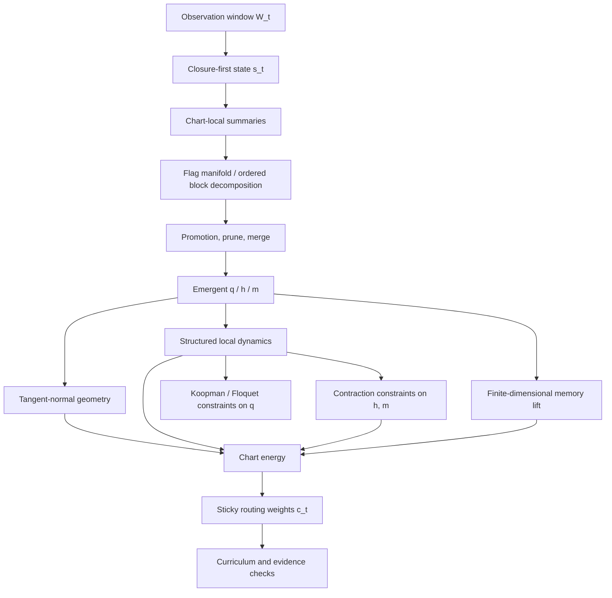

# Closure-First Technical Outline

Date: 2026-03-18

Status: technical outline only. This file records the technology stack, role assignment, and dependency order. The full mathematical specification is given in `docs/closure_first_info_koopman_full_model_20260318.md`.

## 1. Target

We want one model family that can address:

- stable equilibria;
- stable limit cycles;
- chart-local modeling of more complex or chaotic regimes;
- automatic regime routing;
- fast-slow separation;
- transverse contraction;
- finite-dimensional memory closure;
- structured `q/h/m` emergence from observations.

The design goal is not "one giant latent that does everything."
The design goal is a layered stack in which each technology has a specific role.

## 2. Technology Stack and Role Assignment

| Technology | Mathematical object | Main role |
| --- | --- | --- |
| closure-first encoding | `s_t = E(W_t)` | convert finite observation windows into a unified closure-capable latent state |
| multi-chart atlas | charts `k = 1,\dots,K` with routing weights `c_{t,k}` | separate basins, regimes, or local attractor families |
| flag manifold / ordered decomposition | chart-local flag `V_{k,1} \subset \cdots \subset V_{k,M_k}` with adapted frame `U_k` | cut latent space into ordered `1D/2D` blocks before assigning semantics |
| block promotion / prune / merge | masks or projectors `\Pi_k^{(q)}, \Pi_k^{(h)}, \Pi_k^{(m)}` | decide which blocks become persistent, closure, memory, or are removed |
| tangent-normal geometry | `g_k(q)`, `T_k(q)`, `N_k(q)` | make `q` tangent/persistent and `h` transverse/closure-like |
| structured local operators | `\phi_k`, `\Psi_k^\perp`, `A_k^m` | evolve persistent, transverse, and memory coordinates with distinct operator families |
| contraction parameterization | norm or symmetric-part bounds on `\Psi_k^\perp` and `A_k^m` | make transverse and memory directions stable by construction |
| Koopman / Floquet regularity | slow block spectral constraints | keep persistent blocks consistent with equilibrium and limit-cycle spectral structure |
| Mori-Zwanzig memory lift | finite-dimensional `m_t` | represent delayed unresolved effects without turning them into current-time geometry shortcuts |
| energy-based routing | chart energy `E_{t,k}` and `softmax(-E_{t,k}/\tau_t)` | choose the chart whose local geometry and dynamics explain the sample best |
| curriculum and evidence checks | staged optimization and smoke obligations | avoid semantic collapse and separate hard guarantees from empirical success |

## 3. Inclusion Structure

The inclusion relations are:

1. the chart atlas acts on the closure state;
2. the flag structure lives inside each chart;
3. `q/h/m` are not primitive states, but promoted subspaces inside the chart-local flag decomposition;
4. tangent-normal geometry is built only after a candidate persistent subspace exists;
5. the memory lift lives inside the non-persistent residual structure and is subordinate to chart-local dynamics;
6. contraction acts on the transverse and memory operators, not on the whole latent indiscriminately;
7. Koopman or Floquet regularity acts on persistent blocks, not on every block.

So the model is not:

```text
encoder -> q/h/m directly
```

but

```text
encoder -> chart -> flag blocks -> q/h/m -> geometry + dynamics
```

## 4. Dependency Order

The minimal dependency order is:

```text
observation window
-> closure-first state
-> chart-local summaries
-> chart-local flag decomposition
-> block scoring and promotion
-> emergent q/h/m
-> tangent-normal geometry
-> structured local dynamics
-> contraction / Koopman / memory constraints
-> chart-energy competition and sticky routing
-> curriculum and evidence checks
```

This is a partial order, not a single rigid chain.
The key dependencies are:

- chart-local flag decomposition depends on the closure state;
- promotion depends on chart-local blocks;
- tangent-normal geometry depends on a candidate persistent coordinate;
- memory lifting depends on the non-persistent residual structure;
- chart energies depend on the chart-local geometry and dynamics already being defined.

## 5. Conflict Avoidance Rules

To keep the stack internally consistent:

1. chart routing must not require the final promoted `q_t` before chart-local blocks exist;
2. flag decomposition must precede `q/h/m` assignment, otherwise `q/h/m` become primitive coordinates again;
3. `m` must affect future dynamics, not the current-time decoder directly, otherwise memory becomes a geometry shortcut;
4. contraction should constrain `h` and `m`, not erase the persistent role of `q`;
5. Koopman or Floquet regularity should constrain persistent blocks only, otherwise phase and transverse semantics get mixed;
6. merge and coexist decisions should act on flag blocks, not on arbitrary post-hoc coordinates.

## 6. Dependency DAG



## 7. What Each Technology Is Trying to Achieve

- closure-first encoding addresses partial observability and finite-window closure;
- multi-chart routing addresses multi-regime or multi-attractor structure;
- flag decomposition addresses ordered latent structure rather than arbitrary coordinates;
- promotion addresses which blocks deserve persistent status;
- tangent-normal geometry addresses fast-slow and on-manifold/off-manifold separation;
- structured operators address equilibrium, phase, and transverse dynamics differently;
- contraction addresses stable closure directions;
- Koopman or Floquet regularity addresses persistent spectral semantics;
- memory lifting addresses unresolved non-Markov effects;
- curriculum and evidence checks address the fact that many semantic goals are not theorem-level guarantees.

## 8. Canonical Reading Order

Read the model in the following order:

1. closure state;
2. chart atlas;
3. flag structure;
4. block promotion;
5. `q/h/m` semantics;
6. geometry;
7. local operators;
8. contraction and spectral constraints;
9. routing;
10. evidence and curriculum.

This is the intended top-down organization for the full mathematical model.
